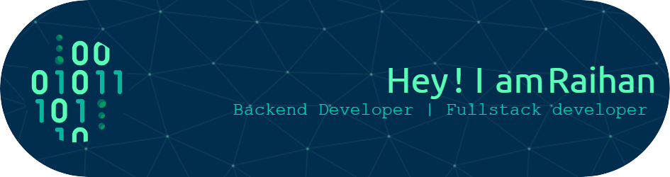

$$
happiness = (mbulll + bubub) \times love
$$

$$
energy = |mbulll - bubub| + love^2
$$

$$
future = (mbulll^{love} + bubub^{love}) / 2
$$

$$
connection = \frac{mbulll \times bubub}{1 - love}
$$

### Hi there, I'm Raihan. I'm a programmer with a passion for coding and exploration. I began my IT career as a web developer/backend engineer for 4 years before deciding to attend college to pursue an education in IT. Coding, and exploration is my hobby :D

## I'm Programmer 🔐
- 👨‍💻 I'm currently freelancer
- 📑 I'm currently learning everything
- 💼 2025 Goals: master of Typescript, Node.js, and python

### My Stats

### My Summary

### Top Languages

### Time for Code

### 3D Contribution

	<picture>
	  <source media="(prefers-color-scheme: dark)"  srcset="https://raw.githubusercontent.com/hidesec/hidesec/output-3d-contrib/profile-night-rainbow.svg" />
	  <source media="(prefers-color-scheme: light)" srcset="https://raw.githubusercontent.com/hidesec/hidesec/output-3d-contrib/profile-south-season-animate.svg" />
	  
	</picture>

### Connect with me:

 
### Languages and Tools:

###

<picture>
  <source media="(prefers-color-scheme: dark)" srcset="https://raw.githubusercontent.com/hidesec/hidesec/output/pacman-contribution-graph-dark.svg">
  <source media="(prefers-color-scheme: light)" srcset="https://raw.githubusercontent.com/hidesec/hidesec/output/pacman-contribution-graph.svg">
  
</picture>

###
